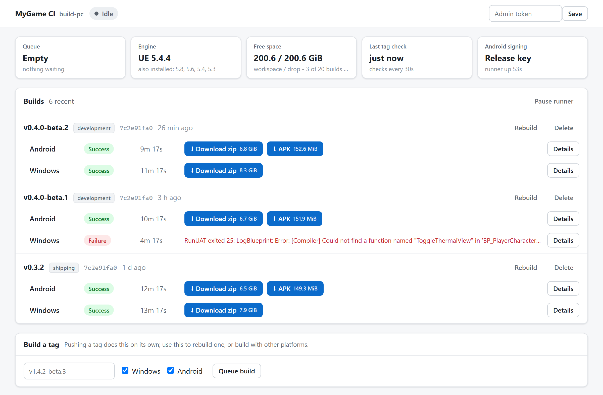

# smackcicd
[turn tmz to smackcicd, huh](https://youtu.be/kPPyUO6m3-4?t=32)

[](https://github.com/sudotman/smackcicd/actions/workflows/ci.yml)
[](LICENSE)

push a tag. get a packaged unreal engine build. <3

smackcicd is a small, self-hosted build runner for unreal engine projects. it
watches your git server for version tags, builds, cooks and packages the
project for windows, android and linux, and publishes the result: a release on
your forge, commit status, checksums, and one-click download links on its own
dashboard.

made for studios and solo devs who already have a build pc and a gitea, forgejo
or github repo, and just want packaging to be boring. no ci platform, no agents,
no yaml pipelines, no cloud runners. one python process and the standard
library.

<br clear="left" />

<picture>
  <source media="(prefers-color-scheme: dark)" srcset="docs/images/dashboard-dark.png">
  
</picture>

---

## install

on the build pc, with python 3.11+, git and unreal engine installed:

```bash
pip install git+https://github.com/sudotman/smackcicd.git
```

or from a clone:

```bash
pip install -e ".[dev]"
```

---

## use it

```bash
smackcicd init              # finds what it can, asks for the rest
smackcicd doctor            # checks this machine can actually build
smackcicd service install   # runs it in the background, from boot
```

then push a tag:

```bash
git tag -a v0.1.0-alpha.1 -m "first ci build" && git push origin v0.1.0-alpha.1
```

and open the dashboard `init` printed (by default `http://<build-pc>:9099/`).
the tag gets picked up within a minute by polling, or instantly once you add
the webhook (`smackcicd webhook` tells you what to paste).

**init** doesn't make you hand-edit paths. it finds your unreal installs (the
registry, the epic launcher, registered source builds, the usual folders on
every drive), the android sdk / ndk / jdk, the `.uproject`, your git remote and
whether it's gitea or github, then writes one commented `smackcicd.toml`.
**doctor** reads each engine's own android requirements and tells you the exact
`sdkmanager` command for anything missing. **service install** sets up a
windows scheduled task with a watchdog, or a systemd unit on linux.

---

## tags

| tag | builds |
| --- | --- |
| `v1.4.2` | shipping, default platforms |
| `v1.4.2-rc.1` | shipping, marked pre-release |
| `v1.4.2-beta.3` | development |
| `v1.4.2-alpha.1+android` | development, android only |
| `v1.4.2-beta.1+win.linux` | windows and linux |
| `v1.4.2-beta.1+ue54` | built with unreal 5.4 |
| `v1.4.2-beta.1+ue53.ue54` | built twice, once per engine |

`smackcicd explain <tag>` shows what a tag would build without building it.
the full grammar (and android version codes) is in [docs/tags.md](docs/tags.md).

---

## how it works

1. fetches the tag into a persistent workspace clone and resets onto it,
   keeping derived data and intermediates so builds stay incremental.
2. stamps the version into the project (and the android version code), stages
   a release keystore if you have one, and undoes both afterwards.
3. runs `RunUAT BuildCookRun` once per platform, streaming the log to the
   dashboard.
4. zips each platform into one download, and writes `manifest.json` (what was
   built, from what, with what) and `SHA256SUMS.txt`.
5. creates or updates the release on your forge, attaches the apk and the
   build record, links the big zips from the release notes, sets commit status,
   and optionally pings slack, discord, teams or any url.

---

## the dashboard

build history with download buttons, the live log while something builds, and a
details panel per build: commit, engine, every deliverable with its sha-256, the
staged files grouped by folder, and the end of the log (where the failure
usually is). rebuild, cancel, pause and delete with an admin token.

---

## commands

| command | what it does |
| --- | --- |
| `init` | detect, ask, write the config |
| `doctor` | check git, the forge, engines, android sdk pieces, disk, ports |
| `clone` | create the workspace clone (`--partial` for huge repos) |
| `service install` | background task (windows) or systemd unit (linux) |
| `watch` | run the daemon in the foreground |
| `build <tag>` | build one tag right now |
| `explain <tag>` | what a tag would build |
| `tags` | remote tags and how each would build |
| `status` | recent builds and the queue |
| `webhook` | what to paste on your forge's webhook page |

every command takes `--home <folder>`, so one machine can host several runners.

---

## docs

- [configuration](docs/configuration.md)
- [tag grammar](docs/tags.md)
- [forges: gitea, forgejo, github](docs/forges.md)
- [android builds and signing](docs/android.md)
- [running as a service](docs/service.md)
- [the dashboard](docs/dashboard.md)
- [troubleshooting](docs/troubleshooting.md), every trap this thing has already
  fallen into, so you don't have to

---

## requirements

- python 3.11+, standard library only
- git, plus git-lfs if your repo uses lfs
- unreal engine 4.27 or 5.x on the build pc, launcher or source builds
- for android: the sdk, the ndk version your engine asks for, and jdk 17
  (`doctor` lists exactly what's missing)
- windows hosts build windows, android and linux; linux hosts build linux and
  android

---

## etymology

the name is a nod to [smack dvd](https://en.wikipedia.org/wiki/Ultimate_Rap_League).

---

## contributing

bug reports and prs welcome. see [CONTRIBUTING.md](CONTRIBUTING.md), and
[SECURITY.md](SECURITY.md) for anything sensitive.

## license

[gpl-3.0-or-later](LICENSE). free software, keep it that way.

unreal and unreal engine are trademarks of epic games, inc. smackcicd isn't
affiliated with or endorsed by epic games.
